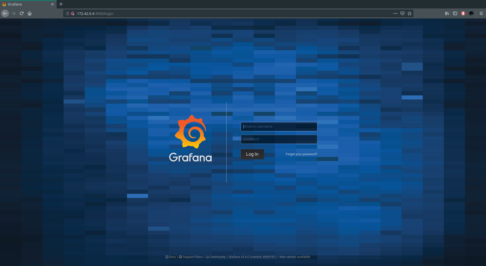

# **TIG [Telegraf, Influxdb, Grafana]**

Open Source Summit 2k18 (Paris)

### **Description**

Docker stack to display data published on `iot.eclipse.org` via **[mosquitto](https://mosquitto.org/)**.

### **Usage**

Executing the `run.sh` script docker will:

+ cleanup your system :warning:
+ create the bridge network from the `network.sh` script
+ deploy the **tig** stack with `docker-compose`

### **Data**

All the data collected from **telegraf** and **influxdb** are stored in the local dir `volumes`.

### **Network**

To see **grafana** in action fire up your browser at `172.42.0.4:3000`.

---

Happy hacking!

### **Doc**

For more info check out the official doc:

+ [telegraf](https://www.influxdata.com/time-series-platform/telegraf/)
+ [influxdb](https://www.influxdata.com/time-series-platform/influxdb/)
+ [grafana](https://grafana.com/)

### **Credits**

+ [mgcrea/docker-compose-tick-stack](https://github.com/mgcrea/docker-compose-tick-stack)

### **GPL License**

This work is licensed under the terms of **[GNU General Public License v3.0](https://www.gnu.org/licenses/gpl.html)**.
